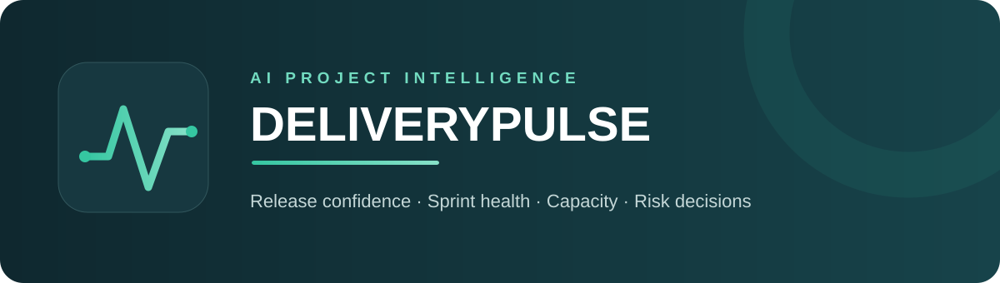
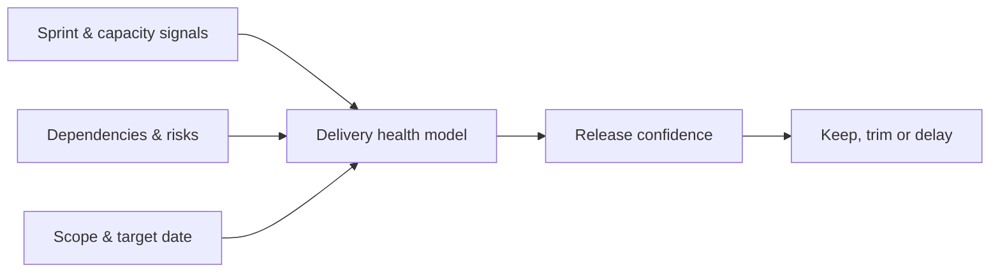

<p align="center"></p>

<p align="center">
  <a href="https://deliverypulse-ai-project-intelligence.niko-rokni.chatgpt.site"></a>
  
  
  
</p>

**DeliveryPulse** is an AI-inspired product and project intelligence dashboard that turns delivery signals into clear release decisions. It helps product, project and engineering leaders monitor sprint health, release confidence, capacity, dependencies and portfolio risks from one command centre.

## Live product

**[Launch DeliveryPulse](https://deliverypulse-ai-project-intelligence.niko-rokni.chatgpt.site)**

The demo includes four interactive product areas:

- **Command centre** — release confidence, scope position, target date and workstream health
- **Delivery** — sprint velocity, cycle time, blocked work and throughput trend
- **Risk register** — ranked exposure with ownership, probability, due dates and resolution actions
- **Roadmap** — outcome-led Now / Next / Later planning

## The product problem

Delivery teams often have plenty of status data but no shared decision model. Roadmaps, sprint boards, capacity plans and risks live in separate tools, so leaders discover schedule problems too late. DeliveryPulse converts those fragmented signals into one explainable release-confidence view and recommends a management action.

## Core decision loop



## Product management evidence

| Area | Deliverable |
|---|---|
| Discovery | Problem statement, personas and jobs-to-be-done |
| Strategy | Product vision, principles and outcome roadmap |
| Definition | PRD, MVP scope, user stories and acceptance criteria |
| Prioritisation | RICE framework and scope scenarios |
| Measurement | North Star, KPI tree and release-confidence model |
| Delivery | Milestones, sprint plan, dependencies and governance |
| Risk | RAID log, risk register and mitigation ownership |
| Stakeholders | RACI and communication cadence |

See the complete case-study documents in [`docs/`](docs/).

## Scenario simulation

The command centre demonstrates a concrete product decision:

| Scenario | Release confidence | Scope | Target |
|---|---:|---|---|
| Current plan | 62% | Full scope | 29 Aug |
| Trim two features | 86% | Reduced scope | 29 Aug |
| Delay two weeks | 94% | Full scope | 12 Sep |

This makes the trade-off between **time, scope and delivery risk** visible to stakeholders instead of hiding it in a status report.

## Technology

`Next.js` · `React` · `TypeScript` · `CSS` · `Cloudflare-compatible deployment`

## Run locally

```bash
npm install
npm run dev
```

Then open `http://localhost:3000`.

## Quality checks

```bash
npm run build
npm run lint
```

## Repository structure

```text
app/                 Product interface and responsive design
docs/                PM and project-management case study
.github/workflows/   Automated build and lint validation
public/              Static assets
```

## Author

Designed and built by **Niko Rokni** as a portfolio case study for Technical Product Manager and Project Manager roles.

